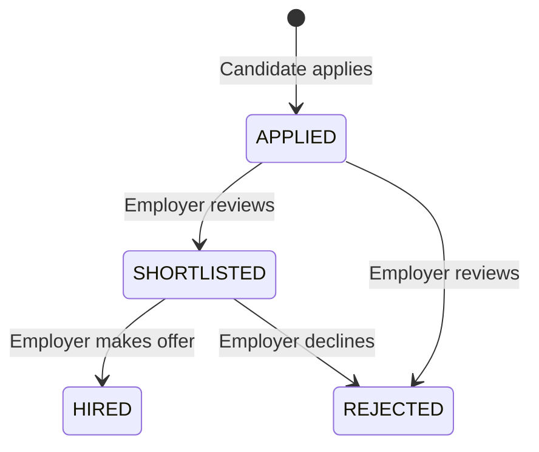

# Job Recruitment REST API (Django + DRF)

A production-ready Job Recruitment REST API built with **Django**, **Django REST Framework (DRF)**, and **SimpleJWT** for role-based job recruitment, application tracking, search & filtering, and status lifecycle management.

---

## Features

- **JWT Authentication**: Secure user registration and login issuing JSON Web Tokens (access & refresh).
- **Role-Based Access Control (RBAC)**:
  - **Employer**: Post jobs, update/delete own jobs, view applicants for posted jobs, and update application statuses (`Applied`, `Shortlisted`, `Rejected`, `Hired`).
  - **Candidate**: Browse and search active jobs, submit applications with resume and cover note, and track application status.
- **Duplicate Prevention**: Database constraints and serializer validation prevent a candidate from applying to the same job multiple times.
- **Search & Filtering**: Search jobs by title, skills, description, company name, location, and filter by job type, experience level, and salary range.
- **PostgreSQL Ready**: Configured for PostgreSQL in production/development with seamless fallback to SQLite.
- **Automated Test Suite**: 32 comprehensive tests covering authentication, RBAC permissions, job CRUD, filtering, applications, and status workflows.

---

## Tech Stack

- **Framework**: Django 5.x
- **API Toolkit**: Django REST Framework (DRF)
- **Authentication**: `djangorestframework-simplejwt`
- **Filtering**: `django-filter`
- **Database**: PostgreSQL (preferred) / SQLite
- **Environment Management**: `python-dotenv`

---

## Project Structure

```text
├── manage.py
├── requirements.txt
├── .env.example
├── .gitignore
├── README.md
├── config/                  # Django project configuration
│   ├── settings.py          # DRF, SimpleJWT, DB & app configuration
│   ├── urls.py              # Root routing & API index
│   └── wsgi.py
├── accounts/                # User management & authentication
│   ├── models.py            # Custom User model (role: EMPLOYER | CANDIDATE)
│   ├── permissions.py       # IsEmployer, IsCandidate
│   ├── serializers.py       # RegisterSerializer, UserSerializer, CustomTokenObtainPairSerializer
│   ├── urls.py
│   ├── views.py
│   └── tests.py             # Auth & profile test cases
├── jobs/                    # Job postings & search
│   ├── models.py            # Job model
│   ├── filters.py           # JobFilter (title, location, skills, salary, job_type)
│   ├── permissions.py       # IsJobOwner, IsJobOwnerOrReadOnly
│   ├── serializers.py       # JobSerializer
│   ├── urls.py
│   ├── views.py             # JobViewSet with custom actions
│   └── tests.py             # Job CRUD, permission, and search tests
└── applications/            # Job application workflow
    ├── models.py            # Application model with unique constraint & status choices
    ├── permissions.py       # IsApplicationJobEmployer, IsApplicationCandidate
    ├── serializers.py       # ApplicationCreateSerializer, ApplicationDetailSerializer, ApplicationStatusUpdateSerializer
    ├── urls.py
    ├── views.py             # ApplyJobView, CandidateApplicationsListView, EmployerApplicationsListView, ApplicationStatusUpdateView
    └── tests.py             # Application submission, duplicate prevention, and status update tests
```

---

## Setup & Installation

### 1. Clone the repository / Navigate to the folder

```bash
cd "Job portal"
```

### 2. Create and activate a virtual environment

**Windows (PowerShell):**
```powershell
python -m venv venv
.\venv\Scripts\Activate.ps1
```

**macOS / Linux:**
```bash
python3 -m venv venv
source venv/bin/activate
```

### 3. Install dependencies

```bash
pip install -r requirements.txt
```

### 4. Configure environment variables

Copy `.env.example` to `.env`:

```bash
cp .env.example .env
```

Edit `.env` to configure your settings.

#### PostgreSQL Configuration (Recommended)
```env
SECRET_KEY=your-secret-key
DEBUG=True
ALLOWED_HOSTS=localhost,127.0.0.1

DB_ENGINE=django.db.backends.postgresql
DB_NAME=job_portal_db
DB_USER=postgres
DB_PASSWORD=your_password
DB_HOST=localhost
DB_PORT=5432
```

> **Note**: If `DB_NAME` is not set or `USE_SQLITE=True`, the project automatically falls back to SQLite (`db.sqlite3`), requiring no database setup.

### 5. Run Database Migrations

```bash
python manage.py makemigrations
python manage.py migrate
```

### 6. Create a Superuser (Optional - for Django Admin)

```bash
python manage.py createsuperuser
```

### 7. Run the Development Server

```bash
python manage.py runserver
```

The server will start at `http://127.0.0.1:8000/`.

---

## Running Automated Tests

Run the complete test suite (32 tests):

```bash
python manage.py test
```

---

## API Documentation & Endpoints

### Base URL: `http://127.0.0.1:8000/api/`

All authenticated endpoints require the `Authorization` header with a Bearer token:
```http
Authorization: Bearer <access_token>
```

---

### 1. Authentication Endpoints (`/api/auth/`)

| Method | Endpoint | Description | Access |
|---|---|---|---|
| `POST` | `/api/auth/register/` | Register a new user (`EMPLOYER` or `CANDIDATE`) | Public |
| `POST` | `/api/auth/login/` | Obtain JWT access and refresh tokens | Public |
| `POST` | `/api/auth/token/refresh/` | Refresh expired access token | Public |
| `GET` | `/api/auth/profile/` | Retrieve current user profile | Authenticated |
| `PUT/PATCH` | `/api/auth/profile/` | Update current user profile | Authenticated |

#### Register Employer Example
```http
POST /api/auth/register/
Content-Type: application/json

{
  "username": "techcorp_hr",
  "email": "hr@techcorp.com",
  "password": "SecurePassword123!",
  "password2": "SecurePassword123!",
  "role": "EMPLOYER",
  "company_name": "Tech Corp Inc.",
  "phone_number": "+1-555-0199",
  "bio": "Leading cloud solutions provider."
}
```

#### Register Candidate Example
```http
POST /api/auth/register/
Content-Type: application/json

{
  "username": "john_dev",
  "email": "john@example.com",
  "password": "SecurePassword123!",
  "password2": "SecurePassword123!",
  "role": "CANDIDATE",
  "first_name": "John",
  "last_name": "Doe",
  "bio": "Full-stack Django & React developer."
}
```

#### Login Example
```http
POST /api/auth/login/
Content-Type: application/json

{
  "username": "john_dev",
  "password": "SecurePassword123!"
}
```

**Response (200 OK):**
```json
{
  "refresh": "eyJhbGciOi...",
  "access": "eyJhbGciOi...",
  "user": {
    "id": 1,
    "username": "john_dev",
    "email": "john@example.com",
    "first_name": "John",
    "last_name": "Doe",
    "role": "CANDIDATE",
    "company_name": null
  }
}
```

---

### 2. Job Endpoints (`/api/jobs/`)

| Method | Endpoint | Description | Access |
|---|---|---|---|
| `GET` | `/api/jobs/` | List all active jobs (supports search & filters) | Public |
| `POST` | `/api/jobs/` | Create a new job posting | Employer Only |
| `GET` | `/api/jobs/<id>/` | Retrieve job details | Public |
| `PUT/PATCH` | `/api/jobs/<id>/` | Update job posting | Job Owner Employer |
| `DELETE` | `/api/jobs/<id>/` | Delete job posting | Job Owner Employer |
| `GET` | `/api/jobs/my-jobs/` | List all jobs posted by the logged-in employer | Employer Only |
| `GET` | `/api/jobs/<id>/applicants/` | List all applicants for a specific job | Job Owner Employer |

#### Create Job (Employer Only)
```http
POST /api/jobs/
Authorization: Bearer <employer_access_token>
Content-Type: application/json

{
  "title": "Senior Python/Django Developer",
  "company_name": "Tech Corp Inc.",
  "description": "We are seeking an experienced Django backend developer to build high-scale APIs.",
  "location": "Remote",
  "job_type": "FULL_TIME",
  "experience_level": "SENIOR",
  "skills_required": "Python, Django, Django REST Framework, PostgreSQL, Docker",
  "salary_min": 120000.00,
  "salary_max": 160000.00,
  "is_active": true
}
```

#### Search & Filter Jobs
```http
GET /api/jobs/?search=Django
GET /api/jobs/?skills=PostgreSQL
GET /api/jobs/?location=Remote
GET /api/jobs/?job_type=FULL_TIME
GET /api/jobs/?min_salary=100000&max_salary=150000
GET /api/jobs/?ordering=-salary_max
```

---

### 3. Application Endpoints (`/api/applications/` & `/api/jobs/<id>/apply/`)

| Method | Endpoint | Description | Access |
|---|---|---|---|
| `POST` | `/api/jobs/<job_id>/apply/` | Apply for a job | Candidate Only |
| `GET` | `/api/applications/my-applications/` | List all applications submitted by candidate | Candidate Only |
| `GET` | `/api/applications/employer-applications/` | List all applications received across all jobs | Employer Only |
| `GET` | `/api/applications/<id>/` | View application details | Applicant or Job Employer |
| `PATCH` | `/api/applications/<id>/status/` | Update application status | Job Owner Employer |

#### Apply for a Job (Candidate Only)
```http
POST /api/jobs/1/apply/
Authorization: Bearer <candidate_access_token>
Content-Type: application/json

{
  "resume_url": "https://linkedin.com/in/johndoe",
  "cover_letter": "I have 5+ years of experience building scalable backend services with Django."
}
```

**Duplicate Application Prevention:**
If the candidate tries to apply again to the same job, the API returns:
```json
{
  "non_field_errors": [
    "You have already applied for this job."
  ]
}
```
*(Status: `400 Bad Request`)*

#### Update Application Status (Employer Only)
```http
PATCH /api/applications/1/status/
Authorization: Bearer <employer_access_token>
Content-Type: application/json

{
  "status": "SHORTLISTED"
}
```
*Allowed status values*: `APPLIED`, `SHORTLISTED`, `REJECTED`, `HIRED`

**Response (200 OK):**
```json
{
  "message": "Application status updated to 'SHORTLISTED'.",
  "application": {
    "id": 1,
    "job_id": 1,
    "job_title": "Senior Python/Django Developer",
    "company_name": "Tech Corp Inc.",
    "candidate_id": 2,
    "candidate_username": "john_dev",
    "candidate_email": "john@example.com",
    "resume_url": "https://linkedin.com/in/johndoe",
    "cover_letter": "I have 5+ years of experience...",
    "status": "SHORTLISTED",
    "applied_at": "2026-09-01T17:00:00Z",
    "updated_at": "2026-09-01T17:05:00Z"
  }
}
```

---

## Application Status Workflow



---

## Summary of Permissions

| Action | Candidate | Employer (Owner) | Employer (Non-Owner) | Anonymous |
|---|:---:|:---:|:---:|:---:|
| Browse & Search Jobs | :white_check_mark: | :white_check_mark: | :white_check_mark: | :white_check_mark: |
| Create Job | :x: (403) | :white_check_mark: | :white_check_mark: | :x: (401) |
| Edit/Delete Job | :x: (403) | :white_check_mark: | :x: (403) | :x: (401) |
| Apply for Job | :white_check_mark: | :x: (403) | :x: (403) | :x: (401) |
| View Own Applications | :white_check_mark: | :x: (403) | :x: (403) | :x: (401) |
| View Job Applicants | :x: (403) | :white_check_mark: | :x: (403) | :x: (401) |
| Update Applicant Status | :x: (403) | :white_check_mark: | :x: (403) | :x: (401) |
